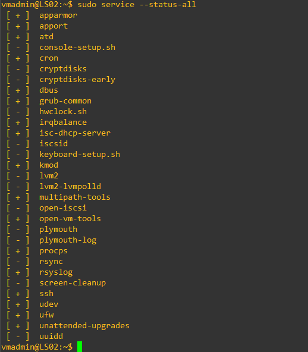

# Useful Linux Commands and Procedures


### Khaled Mahmud

_Khaled.mahmud@unidesh.com_


_Last Updated: May 25, 2020_
<hr>
Table of Contents


(#1-some-basic-linux-commadstasks-)
  - [Change Hostname](#change-hostname)
  - [Change Machine ID](#change-machine-id)
  - [IP Setting: Static and Dynamic](#ip-setting-static-and-dynamic)
  - [SSH Server Installation](#ssh-server-installation)
  - [Checking Status of Services](#checking-status-of-services)
- [Useful Linux Commands and Procedures](#useful-linux-commands-and-procedures)
    - [Khaled Mahmud](#khaled-mahmud)
- [1. Some Basic Linux Commads/Tasks <a id="some-basic-linux-commands"></a>](#1-some-basic-linux-commadstasks-)
  - [Change Hostname](#change-hostname)
  - [Change Machine ID](#change-machine-id)
  - [IP Setting: Static and Dynamic](#ip-setting-static-and-dynamic)
  - [SSH Server Installation](#ssh-server-installation)
  - [Checking Status of Services](#checking-status-of-services)
- [2. DHCP Server](#2-dhcp-server)
  - [Install DHCP Server Package](#install-dhcp-server-package)
  - [DHCP Server Configuration](#dhcp-server-configuration)
  - [Running DHCP6 Service](#running-dhcp6-service)
- [3. DNS Server Installation and Configuration](#3-dns-server-installation-and-configuration)
  - [Verify Current Name Server(s)](#verify-current-name-servers)
  - [Install DNS Server: Bind9](#install-dns-server-bind9)
    - [Verify Bind Configuration Directory](#verify-bind-configuration-directory)
    - [DNS Configuration (Primary Server)](#dns-configuration-primary-server)
  - [Verify DNS Operation](#verify-dns-operation)
  - [DNS Configuration (Secondary Server)](#dns-configuration-secondary-server)
- [4. Enable NAT in Linux](#4-enable-nat-in-linux)
  - [Enable IP Forwarding (Routing)](#enable-ip-forwarding-routing)
  - [Configure IPTABLES](#configure-iptables)


<hr>
<hr>


# 1. Some Basic Linux Commads/Tasks <a id="some-basic-linux-commands"></a>

## Change Hostname

1. Change the hostname using `hostnamectl` command.
2. Then update the `/etc/hosts` file.

```sh
hostnamectl set-hostname ns1
nano /etc/hosts
```

```sh
hostnamectl
```

```yaml
   Static hostname: ns1
         Icon name: computer-vm
           Chassis: vm
        Machine ID: 62447195dfa24f14b70431654bceefbd
           Boot ID: 48f9e70f60dd4a7da20ca1fbf7332320
    Virtualization: oracle
  Operating System: Ubuntu 20.04 LTS
            Kernel: Linux 5.4.0-26-generic
      Architecture: x86-64
```

```sh
cat /etc/hosts
```
```vim
127.0.0.1 localhost
127.0.1.1 ns1
#The following lines are desirable for IPv6 capable hosts
::1     ip6-localhost ip6-loopback
fe00::0 ip6-localnet
ff00::0 ip6-mcastprefix
ff02::1 ip6-allnodes
ff02::2 ip6-allrouters
```

```sh
cat /etc/hostname
```
```vim
ns1
```

<hr>

## Change Machine ID

After cloning from an existing you may find that the machines ID of the new image is same as the old one. Change the machine ID. It&#39;s stored in `/etc/machine-id` file.

```sh
rm /etc/machine-id
systemd-machine-id-setup
```

If this does not create unique ID, just manually change the value (e.g. using nano).
<hr>

## IP Setting: Static and Dynamic

1. Create/Modify the .yaml file in `/etc/netplan` directory to configure IP addresses in the interfaces. The exact name of the .yaml file is fixed. There may be more then one file in this directory. Example configuration is given below. Here the renderer is **networkd**.

```sh
vi /etc/netplan/01-netcfg.yaml
```
```yaml
# This file describes the network interfaces available on your system
# For more information, see netplan(5).
network:
  version: 2
  renderer: networkd
  ethernets:
    enp0s3:
      dhcp4: no
      addresses: [192.168.144.12/24]
      gateway4: 192.168.144.1
      nameservers:
        addresses: [192.168.144.1, 8.8.8.8]
    enp0s8:
      dhcp4: yes
```

2. Use `sudo netplan apply` command to apply the changes. Verify the change using `ip address` command.

```sh
netplan apply
ip address
```

3. To `start` / `restart` / `stop` to check status of **networkd** service, use the following.

```sh
systemctl status system-networkd
```

<hr>

## SSH Server Installation

To get SSH access to a linux machine, you can install `openssh-server`. You can see the status of the server with systemctl command.

```sh
apt-get install opensh-server
systemctl status ssh
```


## Checking Status of Services

1. You can use `service --status-all` command or `systemctl list-unit-files` command to view the status all the installed services.

```sh
service --status-all
systemctl list-unit-files
```



1. Use `systemctl status  <servicename>` command or `service <servicename>  status` command to see the status of a service. The following example shows the status of ssh service.

```sh
service ssh status
systemctl status ssh
systemctl list-unit-files | grep -i ssh.service
```

<hr>
# 2. DHCP Server

## Install DHCP Server Package

The following steps show how to install and configure isc-dhcp-server.

1. Make sure to update and upgrade the linux. The install the dhcp server package.

```sh
apt update
apt apt upgrade
apt-get install isc-dhcp-server
```

2. Verify that all the files are installed in **/etc/dhcp/** directory.


## DHCP Server Configuration

1. Modify/update /etc/default/isc-dhcp-server file to indicate which interface DHCP service will be provided. Find the interface name using ip address command. Interface name is **ens160** in the example below.


2. Enter all the server configuration information in the `/etc/dhcp/dhcpd.conf` file. This file, by default, comes with a lot of configuration examples. You can use the following pattern to configure a range of IP addresses for dynamic allocation, along with domain-name, DNS server and gateway router settings. Also, you can reserve an IP address for static allocation (with MAC address binding).


3. Now, restart the dhcp service. Then you can verity the status of the service.


4. Once the server starts distributing (leasing) IP addresses (and other information) to the clients, you can verify the leasing status using `dhcp-lease-list` command. You can also view the `/var/lib/dhcp/dhcpd.leases` file.


## Running DHCP6 Service

The **isc-dhcp-server** also provide DHCP6 service. Follow the steps below to make server provide IPv6 addresses to the clients.

1. Make sure `/etc/default/isc-dhcp-server` file contains **INTERAFCESv6** parameter, set to the interface where the server is supposed to allocated IPv6 addresses. In the example above, it set to **ens160**.
2. Modify the yaml file in `/etc/netplan/` directory to set IPv6 address to the server, in proper interface.


```sh
cat /etc/netplan/01-netcfg.yaml
```

```yaml
# Generated by VMWare customization engine.
network:
  version: 2
  renderer: networkd
  ethernets:
    ens160:
      dhcp4: no
      dhcp6: no
      addresses:
        - 192.168.144.12/24
        - 2001:db8:90::12/64
      gateway4: 192.168.144.1
      gateway6: 2001:db8:90::1
      nameservers:
        addresses:
          - 142.55.100.25
          - 142.55.44.25
          - 2001:db8:90::11
```

3. Use `sudo netplan apply` command to apply the changes. Verify the change using `ip address` command.

```sh
netplan apply
ip address
```

4. Modify the provided `/etc/dhcp/dhcpd6.conf` file to include desired parameters. A sample is given below.


5. Restart the DHCP6 service. Verify the status of the service.


6. When a client gets a lease of IPv6 address from the server, you can verify the lease list.


<hr>

# 3. DNS Server Installation and Configuration

Mostly used DNS server in linux is **bind9**. The following instructions show you how to install and configure it.

## Verify Current Name Server(s)

There are many places in Linux, you can find DNS related information.

1. The file `resolv.conf` contains IP address of the internal (stub) resolver of the host. You do not need to edit this file. A sample output is given here.

```shell
cat /etc/resolv.conf
```
```sh
# This file is managed by man:systemd-resolved(8). Do not edit.
#
# This is a dynamic resolv.conf file for connecting local clients to the
# internal DNS stub resolver of systemd-resolved. This file lists all
# configured search domains.
#
# Run &quot;resolvectl status&quot; to see details about the uplink DNS servers_
# currently in use.
#
# Third party programs must not access this file directly, but only through the
# symlink at /etc/resolv.conf. To manage man:resolv.conf(5) in a different way,
# replace this symlink by a static file or a different symlink.
#
# See man:systemd-resolved.service(8) for details about the supported modes of
# operation for /etc/resolv.conf.
nameserver 127.0.0.53
options edns0
```


2. Your actual configuration can be found in the `.yaml` file of `/etc/netplan` folder.

```shell
cat /etc/netplan/00-installer-config.yaml
```
```yaml
# This is the network config written by &#39;subiquity&#39;
network:
  version: 2
  renderer: networkd
  ethernets:
    enp0s3:
      dhcp4: false
      addresses:
        - 192.168.144.11/24
      gateway4: 192.168.144.1
      nameservers:
        addresses:
          - 192.168.144.1
    enp0s8:
      dhcp4: true
```

3. You can also check the runtime `resolv.conf` file to see what actual outside server is being used by the OS.

```sh
cat /run/systemd/resolve/resolv.conf
```
```sh
# This file is managed by man:systemd-resolved(8). Do not edit.
#
# This is a dynamic resolv.conf file for connecting local clients directly to
# all known uplink DNS servers. This file lists all configured search domains. 
#
# Third party programs must not access this file directly, but only through the
# symlink at /etc/resolv.conf. To manage man:resolv.conf(5) in a different way,
# replace this symlink by a static file or a different symlink.
#
# See man:systemd-resolved.service(8) for details about the supported modes of
# operation for /etc/resolv.conf.

nameserver 192.168.144.1
```

## Install DNS Server: Bind9

1. Make sure to upgrade your system before you start.
2. Then install `bind9` and `bind9utils`. This will install the servers run (start it).
3. Verify if the server is properly and running. Notice that the daemon is called `named`.
4. Check the listening ports, using `ss` command.

```shell
apt update
apt upgrade
apt install bind9 bind9utils
systemctl status named
```
```sh
● named.service - BIND Domain Name Server
     Loaded: loaded (/lib/systemd/system/named.service; enabled; vendor preset: enabled)
     Active: active (running) since Tue 2020-06-09 02:24:27 UTC; 12min ago
       Docs: man:named(8)
   Main PID: 30139 (named)
      Tasks: 8 (limit: 2282)
     Memory: 19.4M
     CGroup: /system.slice/named.service
             └─30139 /usr/sbin/named -f -u bind
<...output omitted...>
Jun 09 02:24:27 ns1 named[30139]: managed-keys-zone: Initializing automatic trust anchor management fo>
Jun 09 02:24:27 ns1 named[30139]: resolver priming query complete
```

```shell
ss -ltun
```
```vim
Netid  State   Recv-Q  Send-Q  Local Address:Port     Peer Address:Port  Process
udp    UNCONN  0       0    192.168.56.109:53            0.0.0.0:\*
udp    UNCONN  0       0    192.168.56.109:53            0.0.0.0:\*
udp    UNCONN  0       0       192.168.144.11:53            0.0.0.0:\*
udp    UNCONN  0       0       192.168.144.11:53            0.0.0.0:\*
udp    UNCONN  0       0       127.0.0.1:53             0.0.0.0:\*
udp    UNCONN  0       0       127.0.0.1:53             0.0.0.0:\*
udp    UNCONN  0       0       127.0.0.53%lo:53             0.0.0.0:\*
udp    UNCONN  0       0       192.168.56.109%enp0s8:68     0.0.0.0:\*
udp    UNCONN  0       0       [::1]:53                [::]:\*
udp    UNCONN  0       0       [::1]:53                [::]:\*
udp    UNCONN  0       0       [fe80::a00:27ff:feb1:9849]%enp0s3:53     [::]:\*
udp    UNCONN  0       0       [fe80::a00:27ff:feb1:9849]%enp0s3:53    [::]:\*
udp    UNCONN  0       0       [fe80::a00:27ff:fe37:cc3e]%enp0s8:53    [::]:\*
udp    UNCONN  0       0       [fe80::a00:27ff:fe37:cc3e]%enp0s8:53    [::]:\*
tcp    LISTEN  0       4096    127.0.0.1:953           0.0.0.0:\*
tcp    LISTEN  0       10      192.168.56.109:53       0.0.0.0:\*
tcp    LISTEN  0       10      192.168.144.11:53       0.0.0.0:\*
tcp    LISTEN  0       10      127.0.0.1:53            0.0.0.0:\*
tcp    LISTEN  0       4096    127.0.0.53%lo:53        0.0.0.0:\*
tcp    LISTEN  0       128     0.0.0.0:22             0.0.0.0:\*
tcp    LISTEN  0       4096    [::1]:t              [::]:\*
tcp    LISTEN  0       10      [fe80::a00:27ff:fe37:cc3e]%enp0s8:53    [::]:\*
tcp    LISTEN  0       10      [fe80::a00:27ff:feb1:9849]%enp0s3:53    [::]:\*
tcp    LISTEN  0       10      [::1]:53               [::]:\*
tcp    LISTEN  0       128     [::]:22                [::]:\*
```

### Verify Bind Configuration Directory

List the files in the configuration directory of **bind9**, which is `/etc/bind`. This directory contains configuration files as well as template zone database (resource record) files. Some template zone files are provided by default. We will modify these files, as required, to customize out DNS server.

```shell
cd /etc/bind
ls -l
```
```sh
total 48
-rw-r--r-- 1 root root 1991 May 15 12:03 bind.keys
-rw-r--r-- 1 root root  237 Apr 15 17:59 db.0
-rw-r--r-- 1 root root  271 Apr 15 17:59 db.127
-rw-r--r-- 1 root root  237 Apr 15 17:59 db.255
-rw-r--r-- 1 root root  353 Apr 15 17:59 db.empty
-rw-r--r-- 1 root root  270 Apr 15 17:59 db.local
-rw-r--r-- 1 root bind  463 Apr 15 17:59 named.conf
-rw-r--r-- 1 root bind  498 Apr 15 17:59 named.conf.default-zones
-rw-r--r-- 1 root bind  165 Apr 15 17:59 named.conf.local
-rw-r--r-- 1 root bind  846 Apr 15 17:59 named.conf.options
-rw-r----- 1 bind bind  100 Jun  9 02:24 rndc.key
-rw-r--r-- 1 root root 1317 Apr 15 17:59 zones.rfc1918
```
```shell
cat db.local
```
```vim
; BIND data file for local loopback interface
;
$TTL    604800
@       IN      SOA     localhost. root.localhost. (
                              2         ; Serial
                         604800         ; Refresh
                          86400         ; Retry
                        2419200         ; Expire
                         604800 )       ; Negative Cache TTL
;
@       IN      NS      localhost.
@       IN      A       127.0.0.1
@       IN      AAAA    ::1
```


### DNS Configuration (Primary Server)

For DNS configurations, we will modify only (i) `named.conf.options`, and (ii) `named.conf.local`. For database files, we will create, using the templates, (i) forward zone file, and (ii) reverse zone file. Follow the steps below.

1. Create a directory in `/etc/bind/` folder to store our zone database files.
2. Backup the provided template file before we modify the file.

```shell
mkdir zones
cp named.conf.options named.conf.options.org
cp named.conf.local named.conf.local.org
```
3. Customize `named.conf.options` file. The content may look like the example given below.

```shell
cat named.conf.options
```
```js
options {
        directory "/var/cache/bind";
        //Add forwarders, use ISP's or some public DNS server
        forwarders {
                192.168.144.1; 8.8.8.8;
        };
       //========================================================================
        //Allow query only from own machine or local subnet hosts; or any intended subnet
        //You can specify both IPv4 and IPv6 hosts/subnets
        allow-query { localhost; 192.168.144.0/24; };
        //Allow recursive DNS lookup service for the specified hosts.
        //Generally, for authoritative name servers, we would not allow recursion
        allow-recursion { localhost; 192.168.144.0/24; };
        //
        dnssec-validation auto;
        //Allow IPv6 (or use 'none'; to allow only IPv4)
        listen-on-v6 { any; };
};
```

4. Restart the server and check the status.

```shell
sudo systemctl restart named
sudo systemctl status named
```

5. Update `named.conf.local` file. It should look something like shown below. Here a forward zone and a reverse is created. Note the specified database file names and locations. IP address of secondary (planned) DNS server is provided to allow zone transfer fixed server.

```shell
cat named.conf.local
```

```vim
// Do any local configuration here
//
// Consider adding the 1918 zones here, if they are not used in your
// organization
//include "/etc/bind/zones.rfc1918";
// Create forward and reverse zones

// This is for forward zone
zone "khaledmahmud.net" {

// It is a primary server
  type master;

// Location of forward zone file for this domain
  file "/etc/bind/zones/db.for.khaledmahmud.net";

// Do not allow dynamic update
  allow-update { none; };

// Allow zone transfer from our secondary server only
  allow-transfer { 192.168.144.12 ;};
  also-notify {192.168.144.12; };
};

//This is for reverse zone
//For Zone name, use first three octets of the subnet, in reverse order, then append 'in-add.arpa';

zone "144.168.192.in-addr.arpa" {
  type master;

  file "/etc/bind/zones/db.rev.khaledmahmud.net";
  allow-transfer { 192.168.144.12 ;};
also-notify {192.168.144.12; };
  allow-update { none; };
};
```
6. Create zone database file for forward zone. The name and location must match the `named.conf.local` file.

```shell
cd zones
nano db.for.khaledmahmud.net
cat db.for.khaledmahmud.net
```
```vim
;
; BIND data file for khaledmahmud.net.
;
$TTL    604800          ; default TTL, 1W
; SOA record specifies parameters for the server and the records
@       IN      SOA     khaledmahmud.net. dnsadmin.khaledmahmud.net. (
                         2020060402     ; Serial, use date of change and an increasing number
                         604800         ; Refresh, 1W
                          86400         ; Retry, 1D
                        2419200         ; Expire, 4W
                         604800 )       ; Negative Cache TTL, 1W
        IN      A       192.168.144.11
;
; Add name servers
@       IN      NS      ns1.khaledmahmud.net.
@       IN      NS      ns2.khaledmahmud.net.
ns1     IN      A       192.168.144.11
ns2     IN      A       192.168.144.12
;
; Add mail server
@       IN      MX  10  mail1.khaledmahmud.net. ;First priority
@       IN      MX  20  mail2.khaledmahmud.net. ;Next priority
mail1   IN      A       192.168.144.13
mail2   IN      A       192.168.144.14
;
; Add other A records
www     IN      A       192.168.144.13
; 
;Add the gateway router, just for fun
R1      IN      A       192.168.144.1
; 
;Add aliases
ftp     IN      CNAME       www.khaledmahmud.net.
```

7. Create zone database file for reverse zone. Again, The name and location must match the `named.conf.local` file.

```shell
nano db.rev.khaledmahmud.net
cat db.rev.khaledmahmud.net
```

```vim
;
; BIND reverse data file for khaledmahmud.net 192.168.144 subnet
;
$TTL    604800          ; default TTL, 1W
@       IN      SOA     ns1.khaledmahmud.net. dnsadmin.khaledmahmud.net. (
                         2020060402     ; Serial
                         604800         ; Refresh, 1W
                          86400         ; Retry, 1D
                        2419200         ; Expire, 4W
                         604800 )       ; Negative Cache TTL, 1W
;
@       IN      NS      ns1.khaledmahmud.net.
; Add desired reverse references (pointers)
11      IN      PTR     ns1.khaledmahmud.net.
13      IN      PTR     mail1.khaledmahmud.net.
14      IN      PTR     mail2.khaledmahmud.net.
```


8. Now, update the `netplan` `.yaml` file with the new DNS server IP address (192.168.144.11). Apply `netplan` change. Add `search` item under `nameservers` item.

```shell
cat /etc/netplan/00-installer-config.yaml
```

```yaml
# This is the network config written by 'subiquity';
network:
  version: 2
  renderer: networkd
  ethernets:
    enp0s3:
      dhcp4: false
      addresses:
        - 192.168.144.11/24
      gateway4: 192.168.144.1
      nameservers:
        addresses:
          - 192.168.144.11
        search: [khaledmahmud.net]
    enp0s8:
      dhcp4: true
```

```shell
netplan apply
systemctl restart named
systemctl status named
```

9. Before you restart the server again, check of the configuration is OK. Also, check the zone files are defined properly. Use 'named-checkconf' and 'named-checkzone' utilities.

```shell
#Check the configuration
named-checkconf

#Check the zone syntax_
#Check your domain name against the forward zone file.
named-checkzone khaledmahmud.net /etc/bind/zones/db.for.khaledmahmud.net

#Check your subnet against the reverse zone file.
named-checkzone 144.168.192.in-addr.arpa /etc/bind/zones/db.rev.khaledmahmud.net
```

10. Restart **bind9** (`named`). Check the status of the server to make sure it is running properly.

## Verify DNS Operation

Let us verify if our DNS server is properly working.

1. Ping a domain name in the internet.
2. Use `host` utility to resolve a domain name using our server: 192.168.144.11.

See the sample output here.

```shell
ping www.google.com
```
```shell
PING www.google.com (172.217.164.228) 56(84) bytes of data.
64 bytes from yyz12s05-in-f4.1e100.net (172.217.164.228): icmp_seq=1 ttl=54 time=14.6 ms
64 bytes from yyz12s05-in-f4.1e100.net (172.217.164.228): icmp_seq=2 ttl=54 time=14.9 ms
64 bytes from yyz12s05-in-f4.1e100.net (172.217.164.228): icmp_seq=3 ttl=54 time=17.2 ms
^C
--- www.google.com ping statistics ---
3 packets transmitted, 3 received, 0% packet loss, time 2003ms
rtt min/avg/max/mdev = 14.637/15.556/17.177/1.149 ms
```

```shell
host google.com 192.168.144.11
```

```bash
Using domain server:
Name: 192.168.144.11
Address: 192.168.144.11#53
Aliases:

google.com has address 172.217.0.238
google.com has IPv6 address 2607:f8b0:400b:802::200e
google.com mail is handled by 30 alt2.aspmx.l.google.com.
google.com mail is handled by 10 aspmx.l.google.com.
google.com mail is handled by 40 alt3.aspmx.l.google.com.
google.com mail is handled by 50 alt4.aspmx.l.google.com.
google.com mail is handled by 20 alt1.aspmx.l.google.com.
```


3. Use `dig` utility to see the resource records.

```sh
dig google.com
```
```shell
; <<>> DiG 9.16.1-Ubuntu <<>> google.com
;; global options: +cmd
;; Got answer:
;; ->>HEADER<<- opcode: QUERY, status: NOERROR, id: 53637
;; flags: qr rd ra; QUERY: 1, ANSWER: 1, AUTHORITY: 0, ADDITIONAL: 1
;; OPT PSEUDOSECTION:
; EDNS: version: 0, flags:; udp: 65494
;; QUESTION SECTION:
;google.com.                    IN      A
;; ANSWER SECTION:
google.com.             36      IN      A       172.217.0.238
;; Query time: 24 msec
;; SERVER: 127.0.0.53#53(127.0.0.53)
;; WHEN: Tue Jun 09 05:20:53 UTC 2020
;; MSG SIZE  rcvd: 55
```
<hr>

## DNS Configuration (Secondary Server)

Once than a Primary server has been configured, secondary servers can be added to the naming domain. But the primary server is the master for the zone, so a reference to the secondary server must be included in the primary server before anything else. Let us assume that the secondary server IPv4 address is 192.168.144.12.

1. In the primary server's configuration file (`/etc/bind/named.conf`.local), make sure to allow transfer request from the secondary server. Modify both the forward zone and reverse zone.

```vim
// Allow zone transfer from our secondary server only
  allow-transfer { 192.168.144.12 ;};
  also-notify {192.168.144.12; };
```
We do not create or updates zone databases in the secondary server. A secondary name server uses zone transfer to get resource records from a primary server. Follow the following steps to install secondary DNS server in linux.

2. Make sure the server has proper (intended) hostname (e.g. ns2).

```sh
hostnamectl
```

```yaml
   Static hostname: ns2
         Icon name: computer-vm
           Chassis: vm
        Machine ID: f3b9d08af19e4b239828da46edde00ae
           Boot ID: e7b90fd9bedd465694580e3f716ee508
    Virtualization: oracle
  Operating System: Ubuntu 20.04 LTS
            Kernel: Linux 5.4.0-37-generic
      Architecture: x86-64
```

```sh
cat /etc/hosts
```
```vim
127.0.0.1       localhost
127.0.1.1       ns2
# The following lines are desirable for IPv6 capable hosts_
::1     localhost ip6-localhost ip6-loopback
ff02::1 ip6-allnodes
ff02::2 ip6-allrouters
```


3. Install `bind9` and `bind9utils`.

```sh
apt install bind9 bind9utils
systemctl status named
```

4. Edit `/etc/bind/named.conf.local` file. Add zones corresponding to the primary server.

```sh
cat /etc/bind/named.conf.local
```
```js
//
// Do any local configuration here
//
// Consider adding the 1918 zones here, if they are not used in your
// organization
//include "/etc/bind/zones.rfc1918";
//Forward zone
zone "khaledmahmud.net" {
        type slave;
        file "db.for.khaledmahmud.net";
        masters { 192.168.144.11; };
};

//Reverse zone
zone "144.168.192.in-addr.apra" {
        type slave;
        file "db.rev.khaledmahmud.net";
        masters { 192.168.144.11; };
};
```


5. Check the configuration using `named-checkconf` tool.

```sh
named-checkconf
```


6. Restart the server and check the status to make sure it is active.

```sh
systemctl restart named
sudo systemctl status named
```

There is no need to configure the databases because the secondary servers do not maintain such files. Instead, they receive all the naming information from the primary servers which are the only authorized to create new entries in the naming databases. The databases are stored in `/var/cache/bind` directory.

7. Verify the server's operation using `nslookup`, `host` and `dig` tools.

```sh
nslookup ns1
```

```yaml
Server:         127.0.0.53
Address:        127.0.0.53#53
Non-authoritative answer:
Name:   ns1.khaledmahmud.net
Address: 192.168.144.11
```

```sh
nslookup 192.168.144.13
```

```vim
13.144.168.192.in-addr.arpa     name = mail1.khaledmahmud.net.
Authoritative answers can be found from:
```

```sh
dig www.gmail.com
```

```yaml
; <<>> DiG 9.16.1-Ubuntu <<>> www.gmail.com
;; global options: +cmd
;; Got answer:
;; ->>HEADER<<- opcode: QUERY, status: NOERROR, id: 4455
;; flags: qr rd ra; QUERY: 1, ANSWER: 3, AUTHORITY: 0, ADDITIONAL: 1
;; OPT PSEUDOSECTION:
; EDNS: version: 0, flags:; udp: 65494
;; QUESTION SECTION:
;www.gmail.com.                 IN      A
;; ANSWER SECTION:
www.gmail.com.          21599   IN      CNAME   mail.google.com.
mail.google.com.        7199    IN      CNAME   googlemail.l.google.com.
googlemail.l.google.com. 298    IN      A       172.217.1.165
;; Query time: 144 msec
;; SERVER: 127.0.0.53#53(127.0.0.53)
;; WHEN: Mon Jun 15 00:03:18 EDT 2020
;; MSG SIZE  rcvd: 111
```

```sh
dig google.com MX
```

```vim
; <<>> DiG 9.16.1-Ubuntu <<>> google.com MX
;; global options: +cmd
;; Got answer:
;; ->>HEADER<<- opcode: QUERY, status: NOERROR, id: 1776
;; flags: qr rd ra; QUERY: 1, ANSWER: 5, AUTHORITY: 0, ADDITIONAL: 1
;; OPT PSEUDOSECTION:
; EDNS: version: 0, flags:; udp: 65494
;; QUESTION SECTION:
;google.com.                    IN      MX

;; ANSWER SECTION:
google.com.             238     IN      MX      50 alt4.aspmx.l.google.com.
google.com.             238     IN      MX      10 aspmx.l.google.com.
google.com.             238     IN      MX      30 alt2.aspmx.l.google.com.
google.com.             238     IN      MX      20 alt1.aspmx.l.google.com.
google.com.             238     IN      MX      40 alt3.aspmx.l.google.com.

;; Query time: 20 msec
;; SERVER: 127.0.0.53#53(127.0.0.53)
;; WHEN: Mon Jun 15 00:06:06 EDT 2020
;; MSG SIZE  rcvd: 147
```

```sh
dig khaledmahmud.net NS
```

```vim
; <<>> DiG 9.16.1-Ubuntu <<>> khaledmahmud.net NS
;; global options: +cmd
;; Got answer:
;; ->>HEADER<<- opcode: QUERY, status: NOERROR, id: 26240
;; flags: qr rd ra; QUERY: 1, ANSWER: 2, AUTHORITY: 0, ADDITIONAL: 1
;; OPT PSEUDOSECTION:
; EDNS: version: 0, flags:; udp: 65494
;; QUESTION SECTION:
;khaledmahmud.net.              IN      NS
;; ANSWER SECTION:
khaledmahmud.net.       604800  IN      NS      ns2.khaledmahmud.net.
khaledmahmud.net.       604800  IN      NS      ns1.khaledmahmud.net.
;; Query time: 0 msec
;; SERVER: 127.0.0.53#53(127.0.0.53)
;; WHEN: Mon Jun 15 00:06:46 EDT 2020
;; MSG SIZE  rcvd: 81
```


8. You can setup a client PC which configured with only the secondary DNS server. You can verify that the secondary DNS server correctly resolves the dns query. The following example is from VPCS in GNS3.

```sh
PC1>show ip
```

```yaml
NAME        : PC1[1]
IP/MASK     : 192.168.144.80/24
GATEWAY     : 192.168.144.1
DNS         : 192.168.144.12  192.168.144.12
DHCP SERVER : 192.168.144.12
DHCP LEASE  : 349, 600/300/525
DOMAIN NAME : khaledmahmud.net
MAC         : 00:50:79:66:68:00
LPORT       : 10034
RHOST:PORT  : 127.0.0.1:10035
MTU:        : 1500
```

```sh
PC1>ping www.yahoo.com
```
```vim
www.yahoo.com ->> new-fp-shed.wg1.b.yahoo.com
new-fp-shed.wg1.b.yahoo.com resolved to 72.30.35.10
84 bytes from 72.30.35.10 icmp_seq=1 ttl=127 time=31.124 ms
84 bytes from 72.30.35.10 icmp_seq=2 ttl=127 time=108.838 ms
84 bytes from 72.30.35.10 icmp_seq=3 ttl=127 time=26.307 ms
84 bytes from 72.30.35.10 icmp_seq=4 ttl=127 time=25.554 ms
84 bytes from 72.30.35.10 icmp_seq=5 ttl=127 time=25.334 ms

```

<hr>
# 4. Enable NAT in Linux

To set up a linux server to perform NAT service, follow the steps below.

## Enable IP Forwarding (Routing)

For just short term (until next boot), set the value of `/proc/sys/net/ipv4/ip_forward` file to 1.

```sh
echo 1 > /proc/sys/net/ipv4/ip_forward
```


For permanent change (persistent after reboot), edit `/etc/sysctl.conf` file. Uncomment the line containing `net.ipv4.ip_forward = 1`.

## Configure IPTABLES

1. Add a `POSTROUTING` rule to nat table to translate IP addresses coming from the given source IP range. Specify the output interface.

```sh
iptables -t nat -A POSTROUTING -s 10.99.99.0/24 -o enp0s3 -j MASQUERADE
```


2. Check the new rule.

```sh
iptables -t nat -L
```


3. Make the rule persistent with boot. First install the package called iptables-persistent. The save the rule(s) in `/etc/iptables/rules.v4` file. The iptables-persistent tool reads this file during boot.

```sh
apt install iptables-persistent
iptables-save > /etc/iptables/rules.v4
```


